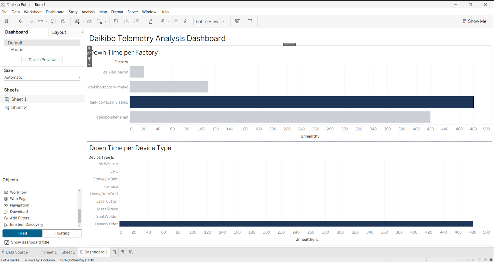

# Machine Health & Equality Analysis Dashboard

## 📊 Overview
This project analyzes machine health and downtime across multiple factories using industrial telemetry data. The objective is to identify performance issues, reduce downtime, and improve operational efficiency through data-driven insights.

---

## 🔍 Key Insights
- Daikibo-Seiko factory recorded the highest downtime, indicating critical operational inefficiencies
- LaserWelder devices showed the highest failure rates across all factories
- Significant variation in machine performance across locations suggests inconsistent maintenance practices

---

## 🛠️ Tools Used
- Tableau (Dashboard creation and data visualization)
- Excel (Data cleaning and preprocessing)

---

## 📁 Dataset Details
- Industrial machine telemetry dataset
- Includes factory location, device type, and machine health status
- Used to identify downtime patterns and performance issues across factories

---

## 🎯 Business Impact
- Helps identify underperforming factories and machines
- Enables data-driven decision-making to reduce downtime
- Supports optimization of maintenance strategies and operational efficiency

---

## 📷 Dashboard Preview

